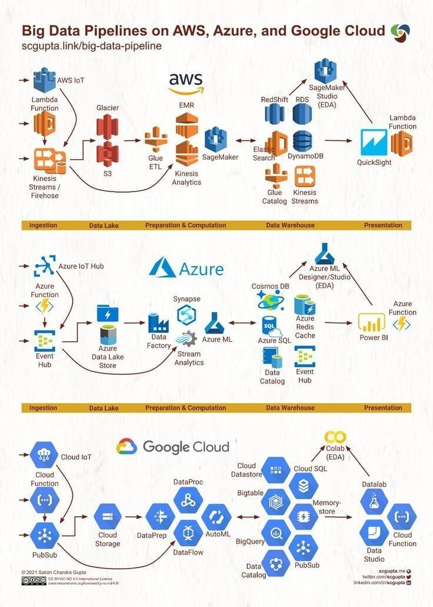
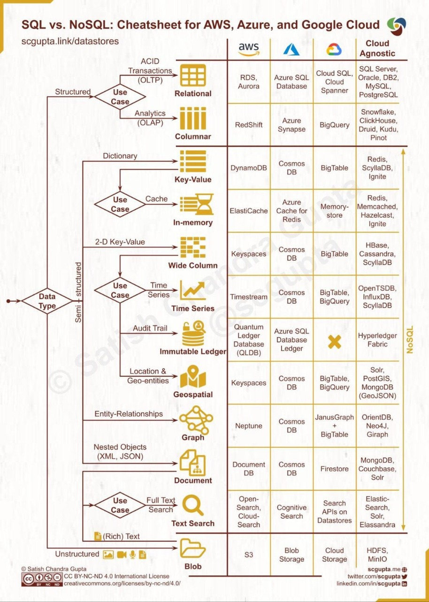

# Cloud

## Intro

Cloud in data engineering is a core concept and a must-known, here in this session we listed the 3 main cloud providers and it features.

## Comparisons

### What a data pipeline in each Cloud Provider looks like?

### SQL and NoSQL in differents clouds

