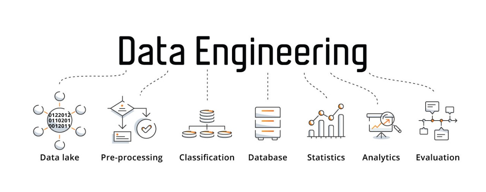
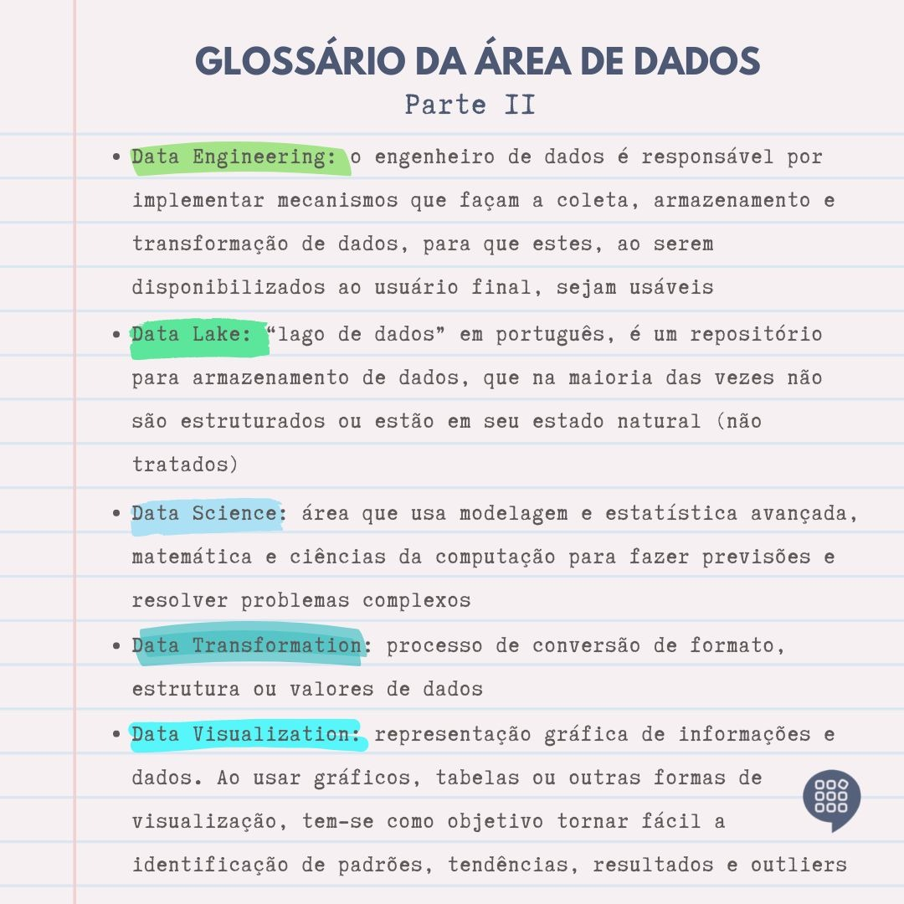

# Links

## Data Enginnering Roadmap - How to Become a Data Engineer in 2022?
-  https://www.mltut.com/how-to-become-a-data-engineer/

## [Dica rápida] Kafka + CDC + SQL Server + Docker
- https://medium.com/xp-inc/dica-r%C3%A1pida-kafka-cdc-sql-server-docker-dfaff87a3ca2

## Data Mesh Principles and Logical Architecture
- https://martinfowler.com/articles/data-mesh-principles.html#DataAsAProduct

## Mais 2 Técnicas de SQL que todos em Engenharia de Dados deveriam saber — Parte 2
- https://medium.com/@bernardo.costa/mais-2-t%C3%A9cnicas-de-sql-que-todos-em-engenharia-de-dados-deveriam-saber-parte-2-67676025b549

## The Baseline Data Stack - Going Beyond The Modern Data Stack - Part 1
- https://seattledataguy.substack.com/p/the-baseline-datastack-going-beyond

## How to develop data pipeline in Airflow through TDD (test-driven development)
- https://blog.magrathealabs.com/how-to-develop-data-pipeline-in-airflow-through-tdd-test-driven-development-c3333439f358

# Concepts

## Data Engineering PipeLine

## Glossario da Area de Dados

# Projects and Repositories

## Roadmap de Engenharia de Dados
- https://github.com/indramaia/data-engineer-roadmap-1